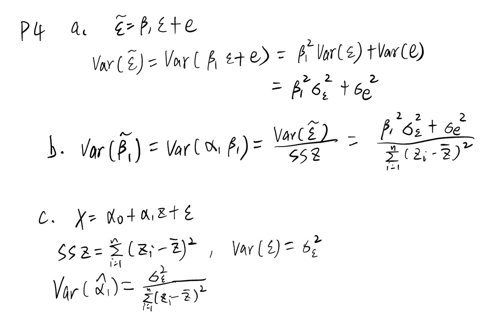

```{r setup, include=FALSE}
knitr::opts_chunk$set(echo = TRUE)
```

# Problem 1: Choose all correct answers

## (1a) A clinician chooses to run a case-control study in order to

AB

A. control confounding factors;
B. mitigate a low number of cases in the population for the recruitment of participants;
C. compare with results found in a cohort study;
D. handle missing data.

## (1b) Refer to Figure 6 on page 9 of the Lecture Notes, Chapter II. One of conditions required by an instrumental variable Z to control unmeasured confounders is that

C

A. it is correlated with the outcome variable Y ;
B. it is correlated with the error term e;
C. it is correlated with the exposure variable X;
D. none of the above.

## (1c) In a clinical study that aims to compare a test drug A to placebo P, a clinician plans to design a fully randomized trial in that patients will be allocated with a treatment by chance. In this way, the research is able to

AD

A. get rid of potential confounding effects;
B. maximize the treatment effect of the test drug;
C. ensure data privacy;
D. assess causal effect of the test drug.

## (1d) An epidemiologist plans to design a cohort study to study the influence of PM2.5 concentration on post-transplantation graft survival for ESRD patients in the USA who receive renal replacement therapy. As part of study design, both inclusion and exclusion criteria are created to

CD

A. select only patients exposed to high PM2.5 concentration;
B. reduce sample size for cost saving;
C. establish a causal effect of exposure to PM2.5 on graft survival;
D. define the underlying study population to which analysis results may be applied.

## (1e) A public health scientist plans to conduct an observational study to evaluate the efficacy of the covid booster shot on risk of hospitalization using electronic health records from the U-M university hospital. In this study design, this researcher wants to divide the subjects in the database into several age groups, including 0-5, 6-12, 13-18, 19-50, 51-65, and 65+ years old, in order to

AB

A. address potential heterogeneous risk of hospitalization associated with age;
B. estimate age-specific efficacy of the covid booster shot on risk of hospitalization;
C. have flexibility and convenience in releasing results to the public.
D. mitigate the problem of missing data;

# Problem 2: Seemingly unrelated regression (SUR) is a widely used method to run multi-outcome regression analysis. This modeling approach may be applied for the analysis of screen activity data collected from your mobile devices. Use the R function systemfit with the method option of SUR to fit your own data that you used previously in Homework #1 with the data freeze date of Jan 26, 2024.

(Due to my data was collected after Jan 14, 2024, I set Z(t) = 1 for day t being January, 17 (the second week of the winter semester))

## a

```{r include=FALSE}
setwd("/home/chenggg/BIOSTAT620/BIOSTAT620_HW2")
rm(list = ls())
gc()
library(readxl)
library(dplyr)
library(ggplot2)
library(lubridate)
library(systemfit)
df <- read_excel("ScreenTime_chenggg.xlsx")
df <- df[c(1:13), ]
df$Pickup.1st_EST <- format(as.POSIXct(df$Pickup.1st_PST, format = "%H:%M", tz = "America/Los_Angeles"), "%H:%M", tz = "America/New_York")
df <- df %>% select(-"Pickup.1st_PST")
convert_to_minutes <- function(time) {
  if (!grepl("h", time)) {
    return(as.numeric(sub("m", "", time)))
  }
  if (!grepl("m", time)) {
    return(60*as.numeric(sub("h", "", time)))
  }
  parts <- strsplit(time, "h|m")[[1]]
  as.numeric(parts[1]) * 60 + as.numeric(parts[2])
}

df$Total.ST.min <- sapply(df$Total.ST, convert_to_minutes)
df$Social.ST.min <- sapply(df$Social.ST, convert_to_minutes)
df$is_weekday <- ifelse(wday(df$Date) %in% 2:6, 1, 0)
df$IsBeforeJan17 <- ifelse(df$Date < as.Date('2024-01-17'), 1, 0)
```

For Total Screen Time:

Intercept: 301.8008

Total.ST.min_lag (Lagged Total Screen Time): -122.7729

is_weekday (Weekday Dummy Variable): -124.9146

IsBeforeJan17 (Dummy for After or Before Jan 17): 79.9354


For Total Social Screen Time:

Intercept: 202.6318

Social.ST.min_lag: -44.2149

is_weekday: -111.6319

IsBeforeJan17: 29.6427

```{r}
df$Total.ST.min_lag <- c(NA, acf(df[[3]], plot = F)$acf) # total ST
df$Social.ST.min_lag <- c(NA, acf(df[[5]], plot = F)$acf) # total social ST

eq1 <- Total.ST.min ~ Total.ST.min_lag + is_weekday + IsBeforeJan17
eq2 <- Social.ST.min ~ Social.ST.min_lag + is_weekday + IsBeforeJan17

fit <- systemfit(list(eq1=eq1, eq2=eq2), data=df, method="SUR")
summary(fit)
```

## b
Two covariates in model eq1 (Total screen use time), total.st.min_lag (total screen use time on a lag) and is_weekday (whether it was a working day or not), were statistically significant at the significance level of alpha = 0.05. In model eq2 (social screen time), is_weekday was the only significant covariate. However, IsBeforeJan17 was not significant in either equation. This means that lagged screen use and whether it was a workday had a significant effect on total screen use, while whether it was a workday also significantly affected social screen use.


## c
The coefficient on Z(t) in both models is not statistically significant at the alpha = 0.05 level, so we cannot reject the null hypothesis. In other words, we do not have sufficient evidence that Z(t) is a significant predictor of either screen-time outcome.

# Problem 3: Consider a linear model that is used to estimate the treatment effect based on a dataset collected from a randomized clinical trial.

## a. Explain why Xi and epsiloni are independent.

The randomization process ensured that each subject had an equal chance of receiving either treatment. This ensured that the two groups of subjects were similar in all known or unknown factors that might influence the outcome prior to drug administration.

## b. In model (1), explain which parameter represents the treatment effect of drug A, and explain which parameter represents the treatment effect of drug B.

The parameter beta1 represents the therapeutic effect of drug A. When Xi = 1, the patient received drug A. So beta1 reflects the difference in effect between receiving drug A and not receiving treatment.

The therapeutic effect of drug B is expressed by $-\beta_1$. When $Xi = -1$, $-\beta_1$ represents the change in effect of receiving drug B relative to beta0.

## c. Show that the treatment effects identified in part (b) are invariant for the inclusion of any confounding covariate Z into the model (1).

Since treatment group assignment was randomized, any potential confounding variable Z should be independent of treatment assignment Xi. Random assignment ensures that the distribution of Z is similar in the treatment and control groups if Z is any confounding variable related to Yi. This indicates that the influence of Z on Yi has been equally distributed at random across all treatment groups; hence, the estimated effect of Xi on Yi remains unchanged when Z is included in the model.

## d. Give the estimate of the causal effect (i.e. ATE) when drug B is a placebo.
When drug B is placebo, the mean treatment effect (ATE) of drug A is the average difference in effect between the population receiving drug A and placebo in the randomized controlled trial. This effect difference is directly represented by the parameter beta1 in the model, which quantifies the average effect of drug A relative to placebo.

# Problem 4:



## d

1. Randomly draw a sample of observations from the original dataset with replacement to create a bootstrap sample. 2. Using the bootstrap sample, re-estimate the parameters $\hat{\alpha_1}$ and $\hat{\beta_1}$.
3. Calculate the ratio $\frac{\hat{\beta_1}}{\hat{\alpha_1}}$ using the re-estimated parameters from the bootstrap sample.
4. Repeat steps 1-3.
5. Calculate the sample variance of the bootstrap estimates.

# Problem 5:

